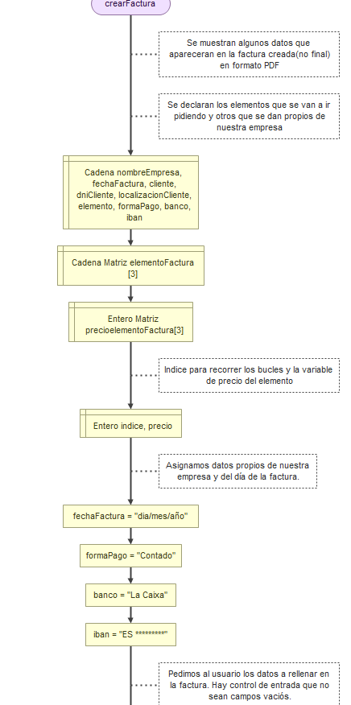

# Documentación Proyecto Domingo Marchan del Pino

## 1. Introducción

### Proyecto: FacturacionDM

### Descripción: una breve descripción del proyecto, sus objetivos y su importancia.

#### Descripción breve:

- El proyecto se basará en un programa que permita al usuario crear, de forma local (de momento), facturas para un negocio. Además, el usuario tendrá control sobre estas y las podrá modificar(de momento no), eliminar, mostrar o buscar.

#### Objetivos:

1. Generar una interfaz agradable para el usuario y que asegure que sólo puede acceder a ella aquel que tenga credenciales.
2. Como mínimo se deberá poder generar facturas en formato PDF dados unos datos en formato json.
3. Se podrán eliminar las facturas, mostrarlas o buscarlas de alguna manera.

#### Importancia:

Es un programa que facilita al usuario el realizar facturas con un formato estándar sin tener que preocuparse de desajustes en word. Será una herramienta sencilla y visual para que personas con bajo nivel en ofimática puedan realizar esta actividad con normalidad.

## 2. Requisitos

### Lista de requisitos: herramientas y bibliotecas necesarias para ejecutar el proyecto.

#### Librerías:

Aún podrían faltar o quitarse algunas librerías.

1) PIL / Pillow ->  poder ajustar imagenes (pip install Pillow)
2) datetime -> dar la fecha cuando se crea la factura y fecha límite de pago.
3) fpdf -> generador de archivo PDF ( pip install fpdf)
4) tkinter como interfaz (alomejor kivy en un futuro)
5) pathlib -> Necesario para la manipulación de rutas
6) os -> para clear o pause screen (no sé si la voy a acabar usando)
7) random -> generador de números aleatórios
8) json -> manipulación de archivos json

## 2. Diseño del proyecto:

### Descripción del diseño: una descripción de alto nivel de cómo se estructurará el código

#### Login screen: (main.py)

Va a aparecer una ventana para que el usuario verifique sus credenciales ( de momento no quiero registrar usuarios).

Las credenciales por defecto serán:

- Usuario: user
- Contraseña: 1234

#### Menú principal: (menu_principal.py)

Se muestra un menú donde clicando en los recuadros se podrán realizar las acciones de:

*1) Crear Factura

*2) Eliminar Factura

*3) Buscar Factura

*4) Mostrar Facturas

*5) Salir (esta de momento la dejo como opción, pero con cerrar la pestaña ya estaría hecho)

Se baraja la opción de incorporar un menú superior con las mismas funcionalidades u otras que por el momento no tengo pensadas.

##### Opción 1: Crear factura

Se destruye la ventana de menú principal y se ejecuta el módulo crear_pdf.py. Este módulo permite la aparición de una ventana emergente.

Se piden los datos al usuario (Pedir), los demás vendrán configurados por defecto (a medida del usuario) o se rellenarán automáticamente. La interfaz gráfica hará visibles los campos rellenados por el usuario (en principio).

Datos presentes en una factura:

    * Logo empresa

    * Datos de la localización de la empresa:

    * calle/ localiz/ CP / TLF / C.I.F o NIF de la empresa / correo

    * Nombre empresa (Pedir)

    * Fecha factura (Pedir)

    * Cliente (Pedir)

    * DNI/NIF cliente (Pedir)

    * Datos de la localización del cliente: (Pedir)

    * calle/ localiz/ CP / TLF

    Tabla 1: (Pedir)

    * Unidades del elemento

    * Elementos de la factura

    * Precio del elemento

    * Precio total del elemento

    Tabla 2:

    * Importe Bruto

    * IVA % *

    * Base imponible

    * IVA *

    * Total Factura

    Tabla 3:

    * Fecha vencimiento factura (a 30 días después de la creación de la factura, pero he de mirar si quiero que sea a día 1 del siguiente més)

    * Forma de Pago

    * Banco

    * IBAN

Al acabar con la introducción de datos, el usuario podrá indicarlo mediante un botón de "Generar Factura" y se generará un PDF, con un nombre autogenerado. Además, se guardará dicho arvhivo en la carpeta de "PDF" previamente creada.

Todos los datos introducidos por el usuario se guardarán en un documento json autogenerado (con el nombre de la factura) que contendrá una lista de un diccionarios correspondiente a la factura. (aún no sé si voy a poder implementar una base de datos)

Al acabar se vuelve al menú principal después de destruir la ventana de crear_pdf.

##### Opción 2: Eliminar factura

Se ejecuta el módulo elminar_factura.py.

Se procederá a mostrar las facturas y se podrán eliminar dado un cliente y un código que se mostrará en pantalla que el usuario deberá de introducir. Si no introduce los datos de forma correcta se mostrará un mensaje.

Otra opción será abrir una ventana con todos los archivos PDF correspondientes a las facturas ya hechas y se podrá eliminar clicando y dandole a suprimir (tengo que darle una vuelta para que sea más fácil aún)

##### Opción 3: Buscar factura
Se ejecuta el módulo buscar_factura.py

Se mostrarán las facturas que hay en la base de datos y se podrán buscar según cliente y un código / número que aparecerá al lado de la factura.

Otra opción será abrir una ventana y realizar una búsqueda normal como siempre se ha hecho mediante windows (he de hacerlo más fácil incluso).

##### Opción 4: Mostrar facturas

Se ejecuta el módulo mostrar_facturas.py.

Se mostrarán las facturas que hay en la base de datos (bien el directorio con los PDF, o las que constan en la base de datos de las facturas introducidas por el usuario en un formato json).

## Diagrama de flujo aproximado de la ejecución del programa. Como mínimo del script principal y una de las funcionalidades.

Programa principal/Menú:

Verifciación user y pass:

Crear PDF:

